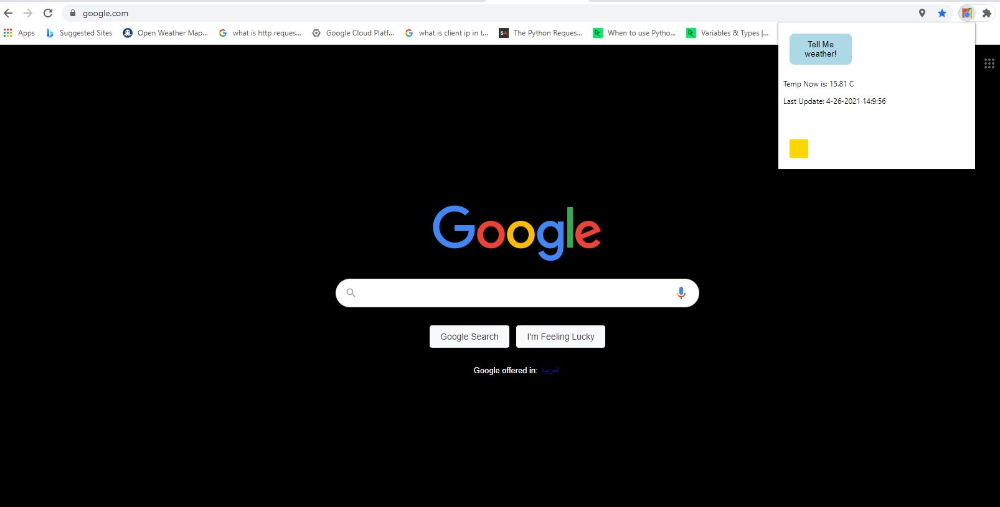

# my_first_chrome_extension
Simple extension to get the weather and to change the current page background color


https://developer.chrome.com/docs/extensions/mv3/getstarted/




# function to get unique cards with preformance:

```javascript
const advanced_get1 = ()=> {
 if (index_const == 0){
    index_const = document.querySelectorAll(".Projects-cover-1nk").length;
  console.log(document.querySelectorAll(".Projects-cover-1nk").length);
 } else {
   let newcheck = document.querySelectorAll(".Projects-cover-1nk").length;

   if (newcheck > index_const){
     index_const = newcheck; console.log(document.querySelectorAll(".Projects-cover-1nk").length);
   } else{
       return false;
   }
 }
  
}
window.addEventListener("scroll", advanced_get1);
advanced_get1();

```
